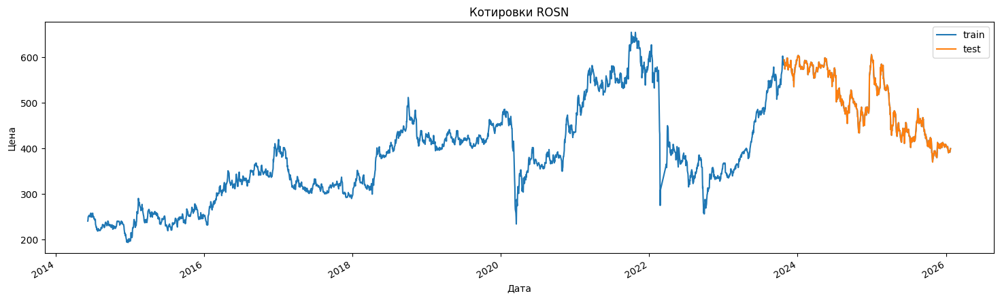
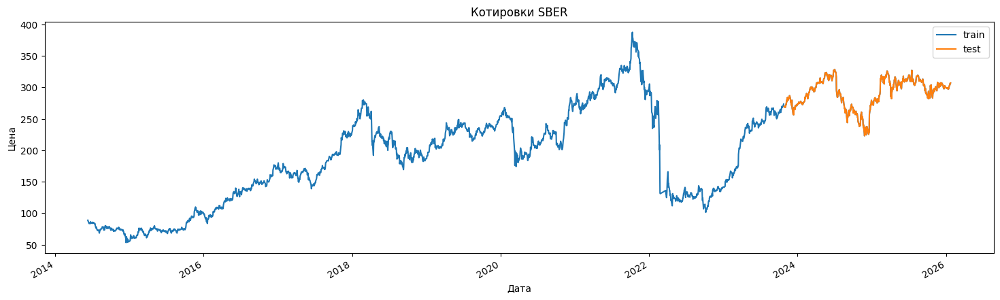

# Прогнозирование цен акций с учетом новостного сентимента

## Обзор проекта

Данный проект посвящен исследованию и сравнению различных архитектур рекуррентных нейронных сетей (RNN) для анализа котировок акций ведущих российских компаний: **Роснефть (ROSN)** и **Сбербанк (SBER)**.

**Цель работы:** повышение точности прогнозирования временных рядов за счет интеграции исторических данных о торгах и результатов сентимент-анализа новостного фона.

В ходе исследования сравнивается эффективность следующих моделей:

* **LSTM** (Long Short-Term Memory)
* **GRU** (Gated Recurrent Units)
* **Attention-based Models** (модели с механизмом внимания)

Тестирование проводилось в двух сценариях: исключительно на рыночных данных и с добавлением признаков новостного сентимента.

## Pipeline разработки

1. **Сбор данных:** Сбор новостного архива с сайта РИА Новости (раздел «Экономика») за период с 1 января 2006 по 25 декабря 2025 года. Для анализа котировок выбран интервал с 2014 года.
2. **Предобработка:** Очистка данных, обработка пропусков, приведение временных форматов и генерация лаговых признаков. Проведение сентимент-анализа текстов.
3. **Разработка моделей:** Проектирование архитектур LSTM, GRU и моделей с механизмом Attention для захвата долгосрочных зависимостей.
4. **Оценка:** Валидация качества прогнозов с использованием метрики **RMSE** (Root Mean Square Error) и визуальный анализ предсказаний.

## Описание датасета

* **Временной интервал:** 1 июля 2014 — 25 декабря 2025 (11 лет).
  
 **Объекты исследования:**
* **ROSN:** Крупнейшая нефтегазовая компания России, обладающая высокой чувствительностью к геополитическим и отраслевым новостям.

* **SBER:** Лидер банковского сектора, выступающий индикатором общего состояния российского рынка.

 **Источники данных:**
* *Новости:* РИА Новости (Экономика).
* *Котировки:* Московская биржа (через библиотеку `apimoex`).

## Предобработка и инженерия признаков (Feature Engineering)

### Обработка данных

* Удаление дубликатов, проверка на консистентность и преобразование типов данных.
* **Сентимент-анализ:** Использование специализированной модели **FinBERT** (`mxlcw/rubert-tiny2-russian-financial-sentiment`), дообученной на финансовых текстах.
* **Агрегация:** Группировка новостей по дням. Для выходных и праздничных дней (когда биржа закрыта) реализована кумулятивная агрегация сентимента к следующему торговому дню.

### Создание признаков

1. **Расчет Sentiment Score:** Вычислялся по формуле:
   $$Sentiment\_Score = \frac{Positive - Negative}{Positive + Negative + 0.25 \cdot Neutral}$$
3. **Технические индикаторы:** Скользящие средние (SMA) и стандартные отклонения (Volatility) за периоды 7 и 14 дней.
4. **Временные признаки:** Извлечение дня недели, месяца и года для учета сезонности.
5. **Сглаживание:** Применение экспоненциального скользящего среднего (**EWM**) к `sentiment_score` и количеству просмотров новостей для уменьшения шума.
6. **Отбор признаков:** Анализ важности признаков (**Feature Importance**) для исключения мультиколлинеарности и выбора наиболее значимых предикторов.

## Результаты и визуализация

